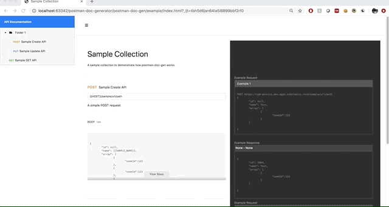

# postman-doc-gen
Generate HTML API documentation from a postman collection.

## Usage

- Download the latest release of the executable from <a href="https://github.com/karthiks3000/postman-doc-gen/releases"> here</a>.
- Open a new terminal and call the executable with the parameter -h to see the help info
    

- To generate documentation using a postman collection, use the following command -
    ```
    ./postman_doc_gen [path/to/collection] -o [path/to/output/folder] 
    ```
    
   

- To apply environment values to the examples, use the following command - 
    ```
    ./postman_doc_gen [path/to/collection] -o [path/to/output/folder] -e [path/to/environment/json]
    ```
    
 
 - The output folder should now show 3 things -
    1. index.html - this is the html documentation generated from the collection
    2. css - this is the css folder consisting of the necessary css files
    3. js - this is the javascript folder consisting of the required js files


## To build locally

- Clone the repository
- pip install the dependencies from the requirements file 
    ```
    pip install -r requirements.txt
    ```
- run the code
    ```
    python postman_doc_gen.py [path/to/collection] -o [path/to/output/folder] 
    ```


## Sample HTML Documentation

A video of the sample html document generated using the collection and environment json files 
present in the example folder



 
## Shout outs


The following tools/repos have been instrumental in building this tool

- <a href="https://palletsprojects.com/p/jinja/">Jinja</a>
- <a href="https://github.com/pyinstaller">PyInstaller</a>
- <a href="https://giphy.com/apps/giphycapture">Giphy Capture</a>
 
    